# Ray Tracer In A Weekend - NodeJS

A Ray Tracer Implementation in NodeJS based on the book [Ray Tracing in A Weekend](http://www.realtimerendering.com/) by [Peter Shirley](https://en.wikipedia.org/wiki/Peter_Shirley).

[DeltaManiac](https://github.com/DeltaManiac) gave a challenge to try *Ray Tracing In A Weekend* in NodeJS, which he implemented himself in [Rust-Lang](https://www.rust-lang.org/) in [here](https://github.com/DeltaManiac/Weekend-Ray-Tracer).

> Work In Progress

## Prequisites

* Clone/Download this repository

* Install [NodeJS](https://nodejs.org)

* `cd` into the cloned folder and run `npm install` to install [Jimp](https://github.com/oliver-moran/jimp) for PNG encoding

## Exercises

### 1. Output An Image

```bash
npm run ex1
```

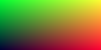

### 2. Rays, A Simple Camera & Background

```bash
npm run ex2
```


### 3. Adding A Sphere

```bash
npm run ex3
```

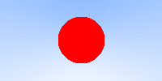

### 4. Surface Normals & Multiple Objects

```bash
npm run ex4
```

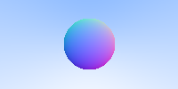

### 5. Surface Normals & Multiple Objects | Hitable

```bash
npm run ex5
```

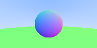

### 6. Antialiasing

```bash
npm run ex6
```

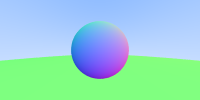

### 7. Diffuse Materials

```bash
npm run ex7
```

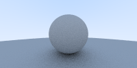

### 8. Metal

```bash
npm run ex8
```

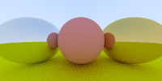

### 9. Metal with Roughness

```bash
npm run ex9
```

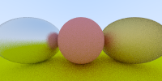

### 10. Dielectrics

```bash
npm run ex10
```

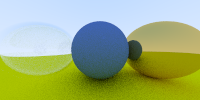

### 11. Positionable Camera

```bash
npm run ex11
```

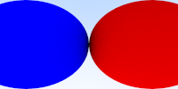

### 11. Positionable Camera - Zoom Out

```bash
npm run ex12
```

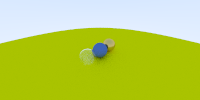

### 11. Positionable Camera - Zoom In

```bash
npm run ex13
```

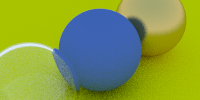

## Author

[Merbin J Anselm](https://github.com/anselm94)

## License

```
MIT License

Copyright (c) 2019 Merbin J Anselm

Permission is hereby granted, free of charge, to any person obtaining a copy
of this software and associated documentation files (the "Software"), to deal
in the Software without restriction, including without limitation the rights
to use, copy, modify, merge, publish, distribute, sublicense, and/or sell
copies of the Software, and to permit persons to whom the Software is
furnished to do so, subject to the following conditions:

The above copyright notice and this permission notice shall be included in all
copies or substantial portions of the Software.

THE SOFTWARE IS PROVIDED "AS IS", WITHOUT WARRANTY OF ANY KIND, EXPRESS OR
IMPLIED, INCLUDING BUT NOT LIMITED TO THE WARRANTIES OF MERCHANTABILITY,
FITNESS FOR A PARTICULAR PURPOSE AND NONINFRINGEMENT. IN NO EVENT SHALL THE
AUTHORS OR COPYRIGHT HOLDERS BE LIABLE FOR ANY CLAIM, DAMAGES OR OTHER
LIABILITY, WHETHER IN AN ACTION OF CONTRACT, TORT OR OTHERWISE, ARISING FROM,
OUT OF OR IN CONNECTION WITH THE SOFTWARE OR THE USE OR OTHER DEALINGS IN THE
SOFTWARE.
```